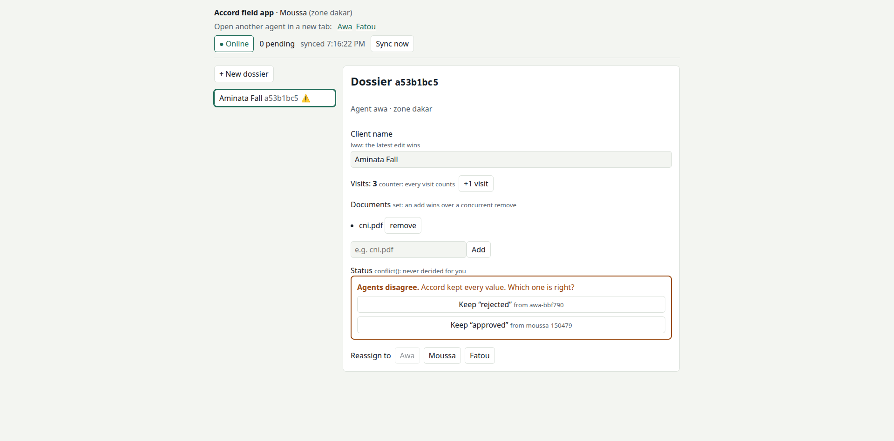

# Accord

**Offline-first sync that stays correct when the network lies.**

Apps keep working with no connection. When it comes back, Accord passes every change along, and
every device ends up with the same data. Every device, in accord.

> **Status: v0.3.0.** Pre-1.0: the API may still change between minor versions.
> Design decisions are recorded in [`docs/adr/`](docs/adr/).

## What it will be

- Apps write **locally first** (SQLite or IndexedDB). The network is never on the critical path of a
  user action.
- Every change is an **operation** in an append-only log, ordered by hybrid logical clocks.
- On reconnect, operations sync both ways and merge by **rules you declare per field**:

  ```ts
  const schema = defineSchema({
    dossier: {
      client_name: lww(), // highest clock wins
      documents: set(), // add-wins set
      visits: counter(), // increments are never lost
      status: conflict(), // never auto-resolved: your app decides
    },
  });
  ```

  See [docs/merge-rules.md](docs/merge-rules.md).

- A self-hosted server (Node, PostgreSQL) enforces who can read and write what.
- Correctness is the product: property-based convergence tests under simulated network faults,
  reproducible by seed.

Last write wins is not an accord. It's a coin toss.

## What Accord is not

- **Not a database.** It syncs records defined by your schema; it is not a general query engine.
- **Not real-time collaboration on free text** in v1. Fields are scalars, sets and counters.
- **Not magic for business conflicts.** If two agents approve the same dossier differently, Accord
  keeps both values and tells your app. It never guesses on money or legal status.

## Run a server

Describe your records and who may see them in an `accord.config.ts`
([example](examples/server/accord.config.ts)):

```ts
export default defineServer({
  schema,
  scopes: { dossier: (r) => [`agent:${r.fields.agent}`, `zone:${r.fields.zone}`] },
  access: (claims) => ({ read: [`agent:${claims.sub}`], write: [`agent:${claims.sub}`] }),
  auth: { jwksUrl: 'https://your-app.example/.well-known/jwks.json' },
});
```

Then `ACCORD_DATABASE_URL=postgres://… accord serve --config accord.config.ts`, or
`docker compose up --build` to try the example. The wire protocol is in
[docs/protocol.md](docs/protocol.md).

## See it work

[`examples/field-app`](examples/field-app/): two agents edit the same dossier offline, then
reconnect. Visits add up, and the status they disagree on is kept as a conflict for them to settle.



## Use it in an app

```ts
const accord = await AccordClient.open({
  schema,
  storage: new IndexedDbStorage('my-app'),
  transport: httpTransport({ url: 'https://sync.example.com', getToken: () => auth.token() }),
});
accord.start();
await accord.inc('dossier:91', 'visits', 1); // works offline
```

Start a project in one command: `npm create accord my-app`.

| Guide                                         |                                                                   |
| --------------------------------------------- | ----------------------------------------------------------------- |
| [docs/client.md](docs/client.md)              | Writes, conflicts, events, storage                                |
| [@accordsync/react](packages/react/README.md) | `useRecord`, `useConflicts`, `useSyncStatus`                      |
| [docs/react-native.md](docs/react-native.md)  | op-sqlite storage, background-friendly sync                       |
| [docs/flutter.md](docs/flutter.md)            | Dart and Flutter packages: drift storage, widgets, lifecycle      |
| [docs/php.md](docs/php.md)                    | PHP server for Laravel, Symfony or plain PHP (PSR-15)             |
| [docs/python.md](docs/python.md)              | Python client, and the server for FastAPI or Django               |
| [docs/scopes.md](docs/scopes.md)              | Tested scope patterns: personal, team, supervisor, tenant, shared |
| [conformance/](conformance/README.md)         | Server conformance suite: run it against any Accord server        |

## Repository layout

| Path                 | What                                                                |
| -------------------- | ------------------------------------------------------------------- |
| `packages/core`      | Pure merge core: clocks, operations, strategies. No I/O.            |
| `packages/client`    | Local-first client: storage adapters, background sync, conflict API |
| `packages/server`    | Sync server: Hono + PostgreSQL                                      |
| `packages/simulator` | Deterministic network and device simulator                          |
| `vectors/`           | Golden test vectors every implementation must pass                  |
| `conformance/`       | Black-box HTTP suite every server implementation must pass          |
| `docs/adr/`          | Architecture decision records                                       |

## Develop

Requires Node 22.12+ (24 recommended), pnpm 11 (`corepack enable`), and Docker for the server
tests.

```sh
pnpm install
pnpm build
pnpm test            # server tests start PostgreSQL 16 with Testcontainers
pnpm lint && pnpm typecheck
pnpm conformance     # black-box server conformance suite (conformance/README.md)

# Convergence suite: more cases, or replay one failing seed exactly
ACCORD_SIM_RUNS=5000 pnpm --filter @accordsync/simulator test
ACCORD_SIM_SEED=1234 pnpm --filter @accordsync/simulator test

docker compose up --build   # PostgreSQL + server on :8080
curl localhost:8080/health
```

## Performance

On one laptop (i7-11800H, PostgreSQL 16 defaults), v0.2 accepted about **3 000 ops/s with 4 server
processes** (`ACCORD_WORKERS=4`) and about 1 600–1 800 with one, with pulls at p95 ≤ 56 ms and no
failed requests up to 200 devices pushing non-stop. Details, hardware and caveats:
[load/README.md](load/README.md).

## Security

Contributions are welcome: see [CONTRIBUTING.md](CONTRIBUTING.md). Report vulnerabilities privately: see [SECURITY.md](SECURITY.md). Before deploying, go through the
[security checklist](docs/security.md).

## Licence

[Apache-2.0](LICENSE).
